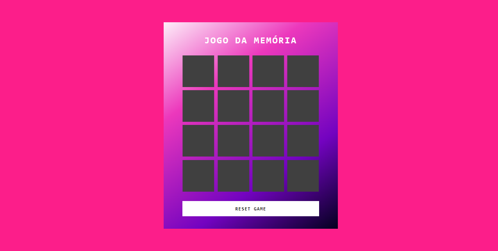
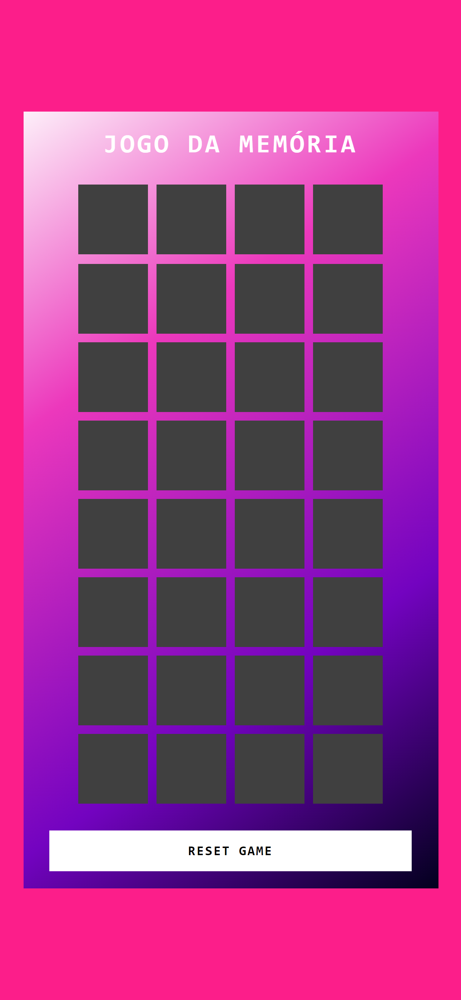

# Jogo da Memória

O clássico jogo da memória com diferentes níveis de dificuldade. Pode ser jogado tanto no computador como no celular.

Design responsivo:

    

## Tecnologias

- HTML
- CSS
- JavaScript

## Para Jogar

 Clique [aqui](https://arianecledja.github.io/js-memory-game/)

## Créditos

Projeto base foi desenvolvido por [Felipe Aguiar](https://github.com/digitalinnovationone/js-emoji-memory-game).